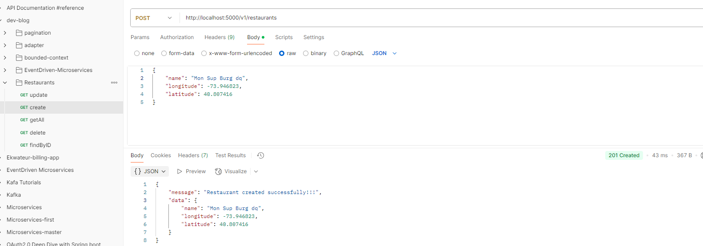
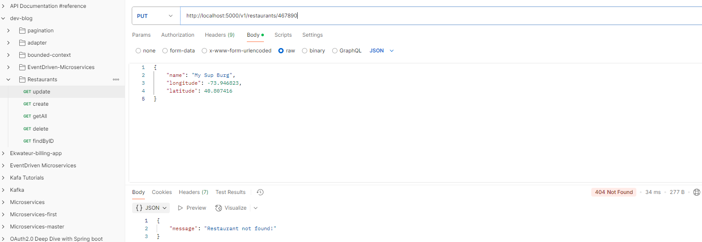
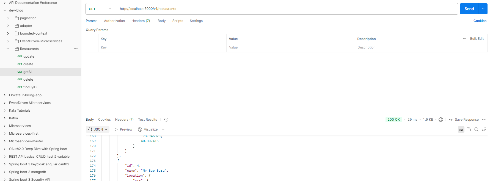
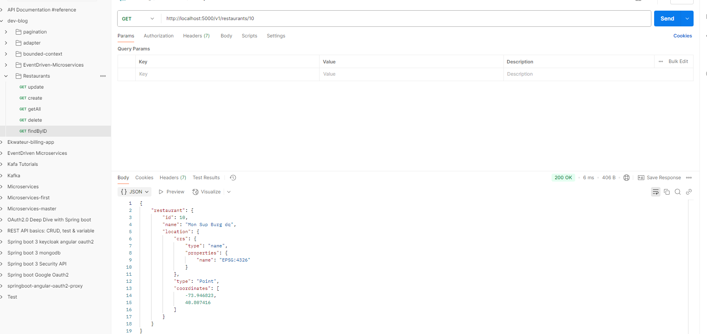
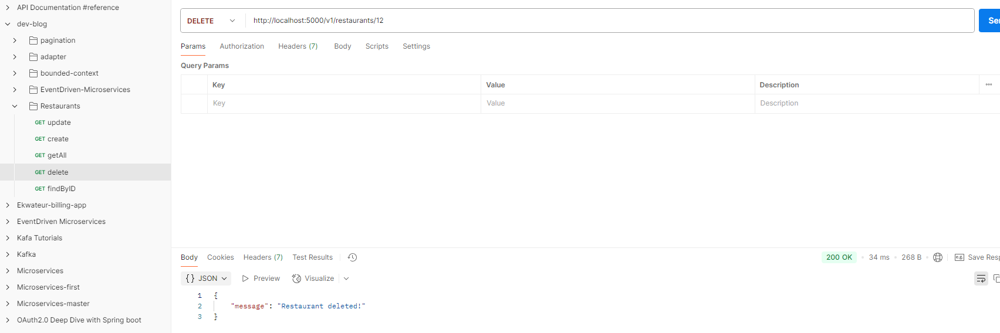

-- https://supabase.com/docs/guides/database/extensions/postgis?queryGroups=language&language=result&queryGroups=database-method&database-method=sql
https://sequelize.org/docs/v7/databases/postgres/
https://dev.to/francescoxx/build-a-crud-rest-api-in-javascript-using-nodejs-express-postgres-docker-jkb

# See docker folder for more details

